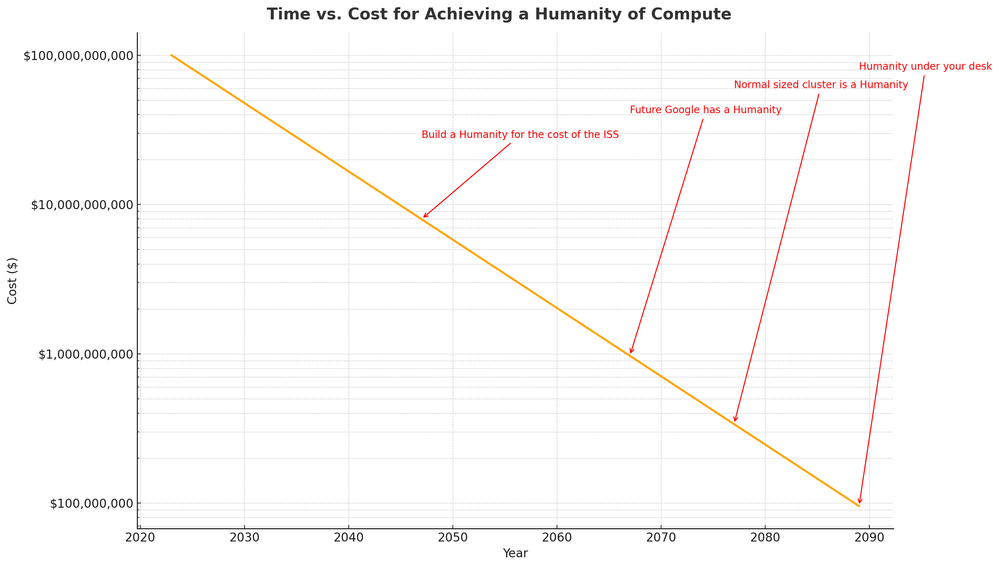

# The Future of Computational Power: From TFLOPS to Humanity

Based on a blog post by [@geohot](https://github.com/geohot) - [A person of compute](https://geohot.github.io/blog/jekyll/update/2023/04/26/a-person-of-compute.html)

Having been made aware of the scarcity of my PFLOPS i asked ChatGPT + Code Interpreter to visualize the ideas of the blog post for me, uploading the page as PDF print.

Prompt:

`The pdf is a print preview of a blogpost that i would like to hang on my wall as infographic. Can you read the text and suggest how to better reformat and / or visualize the points made?`

---

## Comparisons: Evolution of Computational Power

---

## NVIDIA's Computational Progression

---

## Computational Power: TFLOPS vs. Person of Compute

---

## Time vs. Cost for Achieving a Humanity of Compute

---

